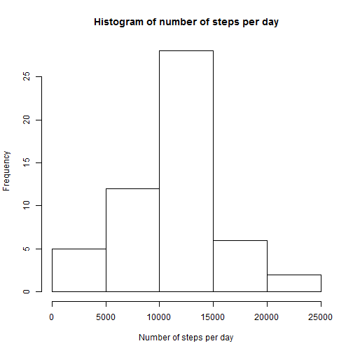
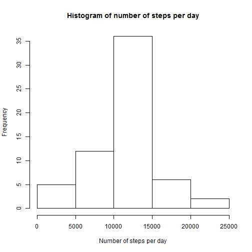

#Reproducible Research
## Peer Assessment 1

### Loading and preprocessing the data

Lets first load the data in activity data frame 

```r
filename <- "repdata-data-activity.zip"
if(!file.exists("activity.csv")) {
        download.file("https://d396qusza40orc.cloudfront.net/repdata%2Fdata%2Factivity.zip",filename)
        unzip(filename) 
}

library(dplyr)
activity <- read.csv("activity.csv") %>% tbl_df()
str(activity)
```

```
## Classes 'tbl_df', 'tbl' and 'data.frame':	17568 obs. of  3 variables:
##  $ steps   : int  NA NA NA NA NA NA NA NA NA NA ...
##  $ date    : Factor w/ 61 levels "2012-10-01","2012-10-02",..: 1 1 1 1 1 1 1 1 1 1 ...
##  $ interval: int  0 5 10 15 20 25 30 35 40 45 ...
```

Now lets convert the date into date format


```r
activity$date <- as.Date(activity$date,format = "%Y-%m-%d")
```

###What is mean total number of steps taken per day?
to answer the Question, lets first calculate the total number of steps taken per day, We will let NA's as is and ignore in procesing.


```r
stepsbydate <- group_by(activity,date)
totstepsbydate <- summarise(stepsbydate, nos = sum(steps))
head(totstepsbydate)
```

```
## Source: local data frame [6 x 2]
## 
##         date   nos
## 1 2012-10-01    NA
## 2 2012-10-02   126
## 3 2012-10-03 11352
## 4 2012-10-04 12116
## 5 2012-10-05 13294
## 6 2012-10-06 15420
```

Now, as we have calculated total number of steps taken per day, 
we will create a histogram showing the trend.


```r
hist(totstepsbydate$nos,main = "Histogram of number of steps per day", 
     xlab = "Number of steps per day", ylab = "Frequency")  
```

 

Calculating mean and median total number of steps taken per day.


```r
mean(totstepsbydate$nos,na.rm = T)
```

```
## [1] 10766.19
```


```r
median(totstepsbydate$nos,na.rm = T)
```

```
## [1] 10765
```

###What is the average daily activity pattern?

Calculate average number of steps based on interval.
We will ignore the cases with NA


```r
stepsbyinterval <- group_by(activity,interval) %>% filter(!is.na(steps))
meanstepsbyinterval <- summarise(stepsbyinterval, means = mean(steps))
```


Time series plot (i.e. type = "l") of the 5-minute interval (x-axis) and the average number of steps taken, averaged across all days (y-axis)


```r
library(ggplot2)
ggplot(data = meanstepsbyinterval, aes(x = interval, y = means)) + geom_line() + 
        xlab("5-minute interval") + 
        ylab("average number of steps taken")
```

 

Which 5-minute interval, on average across all the days in the dataset, contains the maximum number of steps?


```r
maxint <- meanstepsbyinterval[which.max(meanstepsbyinterval$means),]
maxint$interval
```

```
## [1] 835
```


### Imputing missing values
Calculate the total number of missing values in the dataset


```r
totalna <- sum(is.na(activity$steps))
totalna
```

```
## [1] 2304
```

Now, we will create a new dataset activity1 by replacing all "NA" with mean steps taken accross all intervals. 


```r
m <- mean(activity$steps , na.rm = T)

activity1 <- activity
activity1$steps[is.na(activity1$steps)] <- m
```

Lets now create and inspact histogram of the total number of steps taken each day after removing 'NA's


```r
stepsbydate1 <- group_by(activity1,date)
totstepsbydate1 <- summarise(stepsbydate1, nos = sum(steps))

hist(totstepsbydate1$nos,main = "Histogram of number of steps per day", 
     xlab = "Number of steps per day", ylab = "Frequency")  
```

 


Calculating mean and median total number of steps taken per day.


```r
mean(totstepsbydate1$nos,na.rm = T)
```

```
## [1] 10766.19
```


```r
median(totstepsbydate1$nos,na.rm = T)
```

```
## [1] 10766.19
```


As we can see Mean is still the same as we replaced missing data with the mean accross all intervals, however , median is changed as bit as it depends on where the missing values were.

###Are there differences in activity patterns between weekdays and weekends?

Lets first create a function to identify Weekday and Weekend. we will name it 'weekend'.


```r
weekend <- function(date) {
        day <- weekdays(date)
        if (day %in% c("Monday", "Tuesday", "Wednesday", "Thursday", "Friday")) {
                return("weekday") 
        }
        else if (day %in% c("Saturday", "Sunday")) {
                return("weekend")
        }
                
}
```

Create a new factor variable 'day' in the dataset with two levels - "weekday" and "weekend" indicating whether a given date is a weekday or weekend day.


```r
activity1$day <- sapply(activity1$date, FUN = weekend)
```

Make a panel plot containing a time series plot (i.e. type = "l") of the 5-minute interval (x-axis) and the average number of steps taken, averaged across all weekday days or weekend days (y-axis). 


```r
stepsbyinterval1 <- group_by(activity1,interval,day)
meanstepsbyinterval1 <- summarise(stepsbyinterval1, means = mean(steps))

library("lattice")

xyplot(
        type="l",
        data=meanstepsbyinterval1,
        means ~ interval | day,
        xlab="Interval",
        ylab="Number of steps",
        layout=c(1,2)
)
```

 
